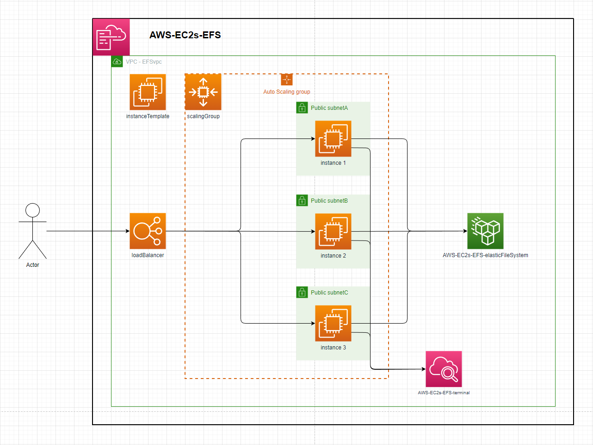
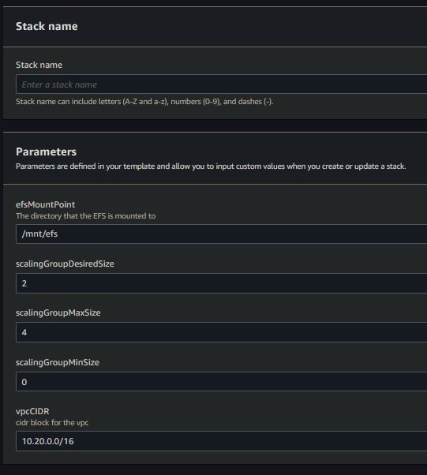

# EC2 instances backed by EFS  

The template in this repository defines an `Applicaiton Load Balancer`, backed by an `Auto Scaling Group` that launches public instances across 3 AZ's that mount a shared `Elastic File System`  

  

---

# Instance:
 - ImageId: ami-084e8c05825742534 (eu-west-2)  
 - InstanceType: t2.micro  
 - UserData:  
   - install & configure amazon-cloudwatch-agent  
   - install & start httpd  
   - mount instance to template defined EFS  

---

# Setup:
1. deploy the template - speficy stack parameters  
  
2. By default this will create a VPC with the default CIDR parameter. The Auto Scaling Group will launch 2 instances in that VPC behind the Load Balancer. Each instance will mount the EFS to the `efsMountPoint` directory & touch a file into that directory.  
3. After resource creation, each instance will be streaming its terminal logs to cloudwatch. Checking the `efsMountPoint` direcotry in any instance will show as many files as there are running instances.  
